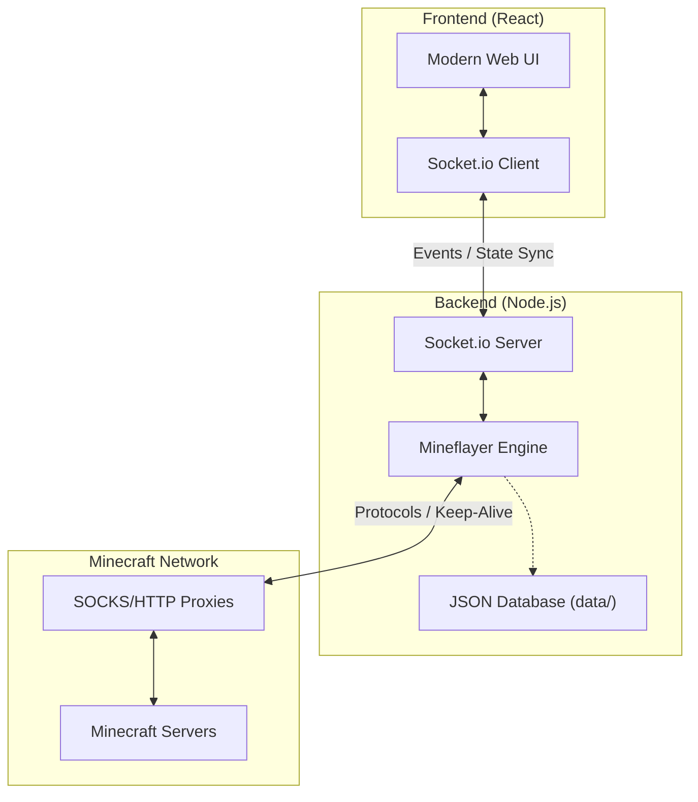

# Web AFK Client: Development Edition


Welcome to the **Development Distribution** of Web AFK Client. This version is a dedicated workspace for testing the latest features, bug fixes, and experimental enhancements before they reach the main release.

> [!CAUTION]
> **UNSTABLE BUILD**: This version is for testing and development purposes only. 
> It may contain critical bugs, performance issues, or incomplete features. 
> **Do not use this build for production environments or critical AFK tasks.**

---

## What is this Build?

This page hosts the latest iteration of our technical roadmap. We use this build to "stress-test" new logic and gather feedback on UI/UX changes.

- **Experimental Logic**: Test new socket event handlers and state sync mechanisms.
- **Cutting-Edge UI**: Preview upcoming dashboard layouts and interactive components.
- **Enhanced Debugging**: This build includes granular logging enabled by default on the backend.

---

## Technical Architecture

The Web AFK Client uses a decoupled architecture to ensure stability and performance. The backend acts as a persistent "Headless Client" while the frontend provides a reactive interface.



---

## Feature Roadmap

Active development is focused on the following areas:

### Near Term (v26.2.0)
- **Auto-Eating**: Integrated hunger management using food in inventory.
- **Inventory Icons**: Visual representation of items in the dashboard.
- **Improved Movement**: Pathfinding-based movement for complex obstacles.

### Future Vision
- **Lua Scripting**: Create custom behavior scripts for bots.
- **Plugin System**: Modular extensions for specialized server tasks (e.g., Faction automation).
- **Multi-Server Sync**: Coordinate groups of bots across different instances.

---

## Recent Changelog

### v26.1.1 — The "Dark & Night" Update
*Focus: State Persistence & Reliability*

#### System Synchronization
- **Full State Persistence**: Bot statuses, health, experience, and inventories now persist reliably across page refreshes using an explicit backend-to-frontend sync.
- **Real-time Sync**: Implemented a robust state synchronization mechanism to ensure the UI always reflects the actual bot state on the server.

#### Dashboard & UI
- **Persistent Dashboard**: You can now view health, experience, hunger, and inventory data that survives browser reloads.
- **Chat History**: Messages are now cached in `localStorage` to prevent data loss during accidental refreshes.
- **Functional Controls**: Added a dedicated **Leave** button to Dashboard cards for easier management.

#### Stability Fixes
- **Power Button Fix**: Resolved issues where the power button on the Connect page failed to handle "spawned" or "connecting" states correctly.
- **Disconnect Robustness**: Re-engineered the "Disconnect All" logic to ensure all active sessions are terminated cleanly.
- **Username Fix**: Fixed a bug where historic chat messages incorrectly displayed "Server" as the sender.
- **Hook Optimization**: Fixed a React hook violation in the Dashboard component to prevent rendering artifacts.

---

## How to Run Development
To get started with this specific build, follow the steps below:

### 1. Backend (Debugger Mode)
```bash
cd backend
npm install
npm run dev # Starts with enhanced logging enabled
```

### 2. Frontend (Hot Reload)
```bash
npm install
npm run dev
```
*The dev server will typically run on `http://localhost:8080`.*

---

## Contributing & Feedback

We rely on your feedback to make the stable release better! 

- **Found a bug?** Open an issue with the prefix `[DEV-BUILD]` in the title.
- **Feature Idea?** Start a discussion or submit a Pull Request.
- **Logs**: If the app crashes, please provide the backend console output for easier tracing.

---

<p align="center">
  <b>Built with passion by SyzDark</b><br/>
  <i>Advancing the future of Minecraft account management.</i>
</p>
